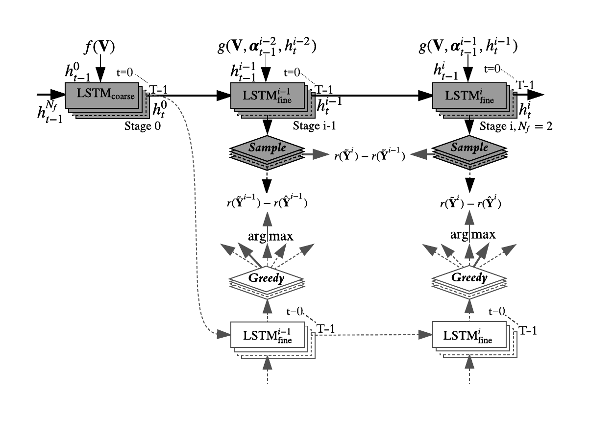
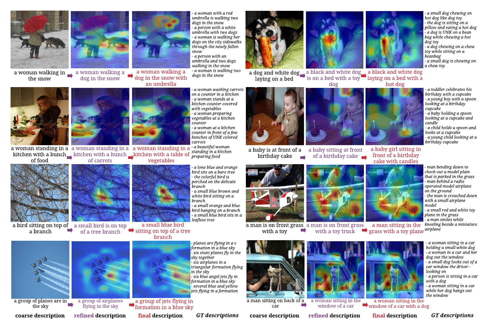

# Stack-Captioning: Coarse-to-Fine Learning for Image Captioning [eval]

> **Accepted as an oral presentation at AAAI-2018**.

```
@inproceedings{gu2017stack,
  title={Stack-captioning: Coarse-to-fine learning for image captioning},
  author={Gu, Jiuxiang and Cai, Jianfei and Wang, Gang and Chen, Tsuhan},
  booktitle={AAAI},
  year={2018}
}
```
## Framework



## Eval
The current code is a complete mess, I am too lazy to clean it up.
If you run the [two stage model](https://share.weiyun.com/53Bk3Pr), you will have the following results:

```bash
Beam size: 5, image 217951: a man is flying a kite in the water
Beam size: 5, image 130524: a desk with two laptops and a laptop computer
Beam size: 5, image 33759: a young boy swinging a baseball bat at a ball
Beam size: 5, image 281972: a young boy holding a baseball bat at a ball
Beam size: 5, image 321647: a baseball player holding a bat on a field
Beam size: 5, image 348877: a close up of a pizza on a table
Beam size: 5, image 504152: a kitchen with lots of tools hanging on a wall
Beam size: 5, image 335981: a group of people standing in front of a store
Beam size: 5, image 455974: an open refrigerator filled with lots of food
Beam size: 5, image 237501: two teddy bears sitting next to each other
Beam size: 5, image 572233: a bride and groom are cutting a wedding cake
Beam size: 5, image 560744: a man sitting at a table with a glass of wine
Beam size: 5, image 74478: a group of people standing around a table
evaluating validation preformance... -1/5000 (0.000000, with coarse_loss 0.000000)
coco-caption/annotations/captions_val2014.json
```

```bash
loading annotations into memory...
Done (t=0.91s)
creating index...
index created!
using 5000/5000 predictions
Loading and preparing results...
DONE (t=0.05s)
creating index...
index created!
tokenization...
PTBTokenizer tokenized 307086 tokens at 795949.92 tokens per second.
PTBTokenizer tokenized 52259 tokens at 404650.36 tokens per second.
setting up scorers...
computing Bleu score...
{'reflen': 47118, 'guess': [47260, 42260, 37260, 32260], 'testlen': 47260, 'correct': [37136, 20995, 10427, 4984]}
ratio: 1.00301371026
Bleu_1: 0.786
Bleu_2: 0.625
Bleu_3: 0.478
Bleu_4: 0.360
computing METEOR score...
METEOR: 0.274
computing Rouge score...
ROUGE_L: 0.569
computing CIDEr score...
CIDEr: 1.208
loss:  0.0
{'CIDEr': 1.2080340073111597, 'Bleu_4': 0.3604371079856478, 'Bleu_3': 0.47804425685454716, 'Bleu_2': 0.6248041363880169, 'Bleu_1': 0.7857807871349813, 'ROUGE_L': 0.5689710128497217, 'METEOR': 0.2741939977947479}
```

### Attention results

